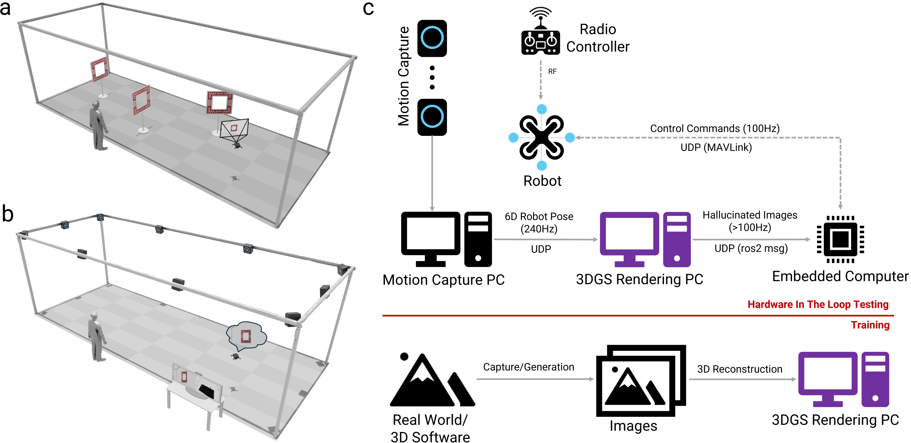
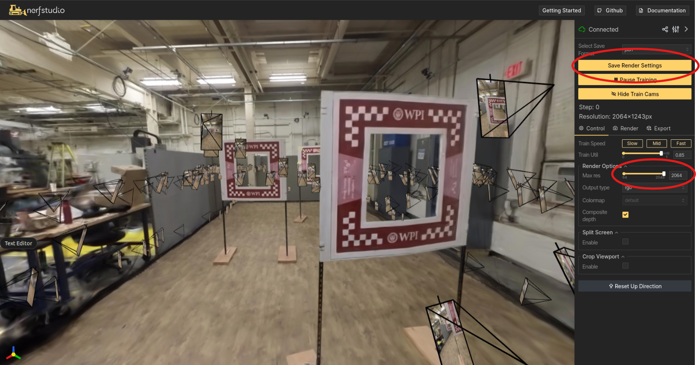

<!-- <span style="color:red;">⚠️ This repo is still under construction and not a finished work. It will be updated incrementally over the next few days until finished.</span> -->


<p align="center">
    <!-- project badges -->
    <a href="https://pear.wpi.edu/research/vizflyt.html"></a>
    <!-- paper badges -->
    <a href="https://pear.wpi.edu/research/vizflyt.html">
        
    </a>
</p>


<div align="center">
<!-- <h1 style="font-size:2.0em;">VizFlyt</h3> -->
<picture>
    <source media="(prefers-color-scheme: dark)" srcset="assets/photos/vizflyt_logo.png" />
    
</picture>
<picture>
    <source media="(prefers-color-scheme: dark)" srcset="assets/photos/banner_image_vizflyt.png" />
    
</picture>
</div>


<div align="center">
<h3 style="font-size:2.0em;">A Perception Centric Pedagogical Framework for Autonomous Aerial Robots</h3>
<h4>Accepted for ICRA 2025</h4>
</div>
<div align="center">

[Quickstart](#quickstart-guide) · [Project Page](https://pear.wpi.edu/research/vizflyt.html)


</div>

---
# **Abstract**

<!-- Autonomous aerial robots are rapidly becoming integral to various industries, necessitating hands-on aerial robotics courses to equip the next-generation workforce with practical expertise. A robust and efficient course framework requires a reliable testbed that ensures realistic testing without hardware risks.

VizFlyt is an open-source perception-centric Hardware-In-The-Loop (HITL) photorealistic testing framework designed to address this need. By leveraging pose from an external localization system, VizFlyt generates real-time, photorealistic visual sensor data using 3D Gaussian Splatting, enabling stress-free validation of autonomy algorithms on aerial robots without the risk of crashes. The system achieves an update rate of over 100Hz, ensuring high-fidelity real-time performance.

Beyond just a framework, VizFlyt introduces a new open-source and open-hardware curriculum, shaping the future of hands-on aerial robotics education. We have validated VizFlyt across multiple real-world HITL experiments, demonstrating its effectiveness and vast potential for research and education.

💡 Want to contribute? Whether you're developing new autonomy algorithms, integrating additional sensors, or creating novel datasets, VizFlyt is designed as a community-driven platform for advancing perception-driven aerial autonomy. -->
<!-- Testing autonomy algorithms for aerial robots in real-world environments is challenging due to safety risks and hardware limitations. VizFlyt is an open-source perception-centric Hardware-In-The-Loop (HITL) testing framework designed to enable photorealistic, real-time evaluation of autonomy stacks without the risk of crashes.

By leveraging pose from an external localization system, VizFlyt hallucinates onboard visual sensors using 3D Gaussian Splatting, achieving a 100Hz+ update rate for high-fidelity perception and control. This allows for safe and scalable Sim2Real validation, bridging the gap between simulation and real-world deployment. VizFlyt also supports an open-source and open-hardware curriculum for hands-on aerial robotics education. -->

Autonomous aerial robots are becoming increasingly common, driving the need for hands-on courses that equip the next-generation workforce with practical skills. A reliable testbed is essential for such courses to be effective.

Introducing VizFlyt, an open-source, perception-centric Hardware-In-The-Loop (HITL) photorealistic testing framework designed for aerial robotics education and research. VizFlyt leverages 3D Gaussian Splatting to generate real-time, photorealistic visual sensor data using pose estimates from an external localization system. This approach enables safe and realistic autonomy testing—without the risk of crashes.

With a system update rate exceeding 100Hz, VizFlyt offers a robust platform for developing and evaluating autonomy algorithms. Building on our experience in aerial robotics education, we also introduce an open-source and open-hardware curriculum based on VizFlyt to support future courses.

We validate VizFlyt through real-world HITL experiments across various course projects, demonstrating its effectiveness and broad applicability.

💡 Want to contribute? Whether it's new autonomy algorithms, sensor integrations, or datasets, VizFlyt thrives on community-driven innovation. Join us in advancing aerial robotics research!


💡 Want to contribute? Whether it’s new autonomy algorithms, sensor integrations, or datasets, VizFlyt is a community-driven platform advancing aerial robotics research.

---

# **Quickstart Guide**

This guide will walk you through setting up **VizFlyt**, installing dependencies, configuring the environment, and downloading necessary data.


## **1. Installation Instructions**

### **1.1 Prerequisites**
Ensure you have the following dependencies installed before proceeding:

- ✅ **[Ubuntu 22.04](https://releases.ubuntu.com/jammy/)**
- ✅ **[NVIDIA Drivers](https://www.nvidia.com/en-us/drivers/)** (For GPU acceleration)
- ✅ **[ROS2 Humble](https://docs.ros.org/en/humble/Installation/Ubuntu-Install-Debs.html)** (Required for ROS-based workflows)
- ✅ **[Miniconda3](https://www.anaconda.com/docs/getting-started/miniconda/install#macos-linux-installation)** (For managing Python environments)

---

### **1.2 Setting Up the VizFlyt Environment**
#### **Step 1: Create and Activate the Conda Environment**
Run the following commands to set up a dedicated Conda environment for VizFlyt:

```bash
# Create a Conda environment with Python 3.10
conda create --name vizflyt -y python=3.10.14

# Activate the environment
conda activate vizflyt

# Upgrade pip
python -m pip install --upgrade pip
```

---

#### **Step 2: Install PyTorch with CUDA Support**
Install **PyTorch** and CUDA dependencies for GPU acceleration:

```bash
pip install torch==2.1.2+cu118 torchvision==0.16.2+cu118 --extra-index-url https://download.pytorch.org/whl/cu118

# Install CUDA Toolkit (Ensure compatibility with PyTorch version)
conda install -c "nvidia/label/cuda-11.8.0" cuda-toolkit

# Install tiny-cuda-nn (for optimized CUDA operations)
pip install ninja git+https://github.com/NVlabs/tiny-cuda-nn/#subdirectory=bindings/torch
```

---

#### **Step 3: Clone the VizFlyt Repository & Install Modified Nerfstudio**
Clone the VizFlyt repository and install the modified **Nerfstudio** framework:

```bash
# Clone the repository
git clone https://github.com/pearwpi/VizFlyt.git

cd VizFlyt/nerfstudio

# Upgrade pip and setuptools before installing dependencies
pip install --upgrade pip setuptools

# Install Nerfstudio in editable mode
pip install -e .
```

---

## **2. Building the VizFlyt ROS2 Workspace**
Once your environment is set up, build the ROS2 workspace:

```bash
pip install --upgrade "numpy<2"
pip install transforms3d gdown pyquaternion

cd vizflyt_ws/

colcon build --symlink-install
```

This ensures all necessary dependencies are installed and the workspace is properly compiled.

---

## **3. Making Your Workflow Easier**
To simplify your workflow, you can define **aliases** in your `~/.bashrc` file for frequently used commands. These are **optional but recommended**.

📌 Note: This workflow assumes that you have cloned VizFlyt in your home directory ($HOME/VizFlyt/). If your working directory is different, update the paths accordingly in the alias definitions.

#### **Step 1: Add Useful Aliases**
Append the following lines to your `~/.bashrc` or `~/.bash_profile`:

```bash
alias viz='conda activate vizflyt'
alias viz_ws='cd $HOME/VizFlyt/vizflyt_ws' 
alias source_ws='source install/setup.bash'
alias source_ws2='source install/local_setup.bash'
alias build_ws='colcon build --symlink-install'
alias set_env='export PYTHON_EXECUTABLE="$HOME/miniconda3/envs/vizflyt/bin/python" && export PYTHONPATH="$HOME/miniconda3/envs/vizflyt/lib/python3.10/site-packages:$PYTHONPATH" && export PYTHONPATH=$PYTHONPATH:$HOME/VizFlyt/nerfstudio'
alias init_vizflyt='viz && viz_ws && source_ws && source_ws2 && set_env && cd src'
```

#### **Step 2: Apply the Changes**
To make the aliases available immediately, run:

```bash
source ~/.bashrc
```

#### **Step 3: Initialize VizFlyt in Every New Terminal** 
Now, every time you open a new terminal, simply run:

📌 Note: Please ensure that you have a successfully built ros2 workspace before executing the below. 

```bash
init_vizflyt
```

This command will:
✔️ Activate the **vizflyt** Conda environment  
✔️ Navigate to the **VizFlyt workspace**  
✔️ Source the required ROS2 setup files  
✔️ Set up the necessary **Python environment variables**  

---


---

## **4. Downloading Data & Pretrained Models**
To fetch required datasets and pre-trained models, run:

```bash
init_vizflyt  # Ensure the environment is set up

chmod +x download_data_and_outputs.sh  # Make script executable

./download_data_and_outputs.sh  # Run the script to download required data
```
---

---

## **5. Executing the VizFlyt HITL Workflow**



VizFlyt supports both **simulated-Hardware-In-The-Loop (s-HITL)** and **Hardware-In-The-Loop (HITL)** for testing autonomous aerial navigation.  
- If you do not have access to a **Vicon motion capture system** or **drone hardware**, you can use the **simulated drone (`fake_drone`)** and **simulated Vicon (`fake_vicon`)** for testing.  
- To integrate **custom autonomy algorithms**, edit the `StudentPerception.py` and `StudentPlanning.py` scripts.  

---

### **5.1 Running VizFlyt s-HITL (fake_drone)**
In this mode, the **Robot** and **Motion Capture** elements are replaced with simulated equivalents.

#### **📌 Steps to Run the Simulation**

1️. **Start the Render Node**  
   Generates **hallucinated sensor data** using **3D Gaussian Splatting**. This may take a few seconds to initialize.
   ```bash
   ros2 run vizflyt render_node
   ```

2️. **Enable Collision Detection**  
   Detects obstacles within the Digital Twin environment. If a collision occurs, the simulation **freezes** and the drone will land.

   ```bash
   ros2 run vizflyt collision_detection_node
   ```

3️. **Start the Fake Vicon Node**  
   Simulates motion capture by reading pose data from the `fake_drone` frame and republishing it.

   ```bash
   ros2 run vizflyt fake_vicon_node_hitl
   ```

4️. **Run the Quadrotor Simulator**  

   - Subscribes to user-defined **trajectories** (position, velocity, acceleration, yaw).  
   - Runs a **cascaded PID controller**, which can be tuned for custom flight behavior.
   ```bash
   ros2 run vizflyt quad_simulator_node
   ```

5️. **Run the User Code Node**  

   - Subscribes to **RGB** and **depth images** and Vicon pose.  
   - Uses the **user-defined perception and motion planning modules** to compute real-time trajectory commands.
   ```bash
   ros2 run vizflyt usercode_node
   ```

6️. **Launch RViz for Visualization**  

   ```bash
   rviz2
   ```

✅ **Expected Outcome:**  
Once all nodes are running, you should see a **visualization of the simulated drone** and its **planned trajectory**:  


---

### **5.2 Deploying VizFlyt HITL on a Physical Drone**
If using a real drone with **Vicon motion capture**, follow these steps:

#### **📌 Steps for Real-World Deployment**

1️. **Launch the Vicon Receiver Node**  
   - Captures real-time **pose updates** from the drone.
   ```bash
   ros2 launch vicon_receiver client.launch.py
   ```

2️. **Start the Render Node**  
   - Generates hallucinated sensor data from the **Digital Twin**.
   ```bash
   ros2 run vizflyt render_node
   ```

3️. **Enable Collision Detection**  
   - Stops rendering and triggers a **landing** in case of collision.
   ```bash
   ros2 run vizflyt collision_detection_node
   ```

4️. **Run the Ardupilot Drone Control Node**  
   - Reads **RGB and depth images** and **Vicon pose**.  
   - Sends **trajectory commands** to the drone using **pymavlink and DroneKit**.
   ```bash
   ros2 run vizflyt ardupilot_drone_control_node
   ```

✅ **Outcome:** The real drone should now follow the planned **autonomous trajectory** while using the **Digital Twin** for navigation feedback.

---


# **Generating a Digital Twin from Your Own Data Using Nerfstudio**

This guide provides step-by-step instructions for generating a high-fidelity **digital twin** using **Nerfstudio**. The workflow covers dataset preprocessing, training, visualization, and exporting an occupancy grid for collision detection.

## **1. Initialize the Workspace**
Ensure your workspace is set up correctly before proceeding:

```bash
init_vizflyt
```

---

## **2. Create a Nerfstudio-Compatible Dataset (SFM Step)**
If your input consists of images, convert them into a format suitable for **Nerfstudio**:

```bash
ns-process-data images \
  --data ./vizflyt_viewer/data/washburn-env6-itr0-1fps/ \
  --output-dir ./vizflyt_viewer/data/washburn-env6-itr0-1fps_nf_format/
```

---

## **3. Train the Environment Model**
Run the training process using **Splatfacto**, which will generate a **Gaussian Splatting-based** representation of the scene:

```bash
ns-train splatfacto \
  --data ./vizflyt_viewer/data/washburn-env6-itr0-1fps_nf_format/ \
  --output-dir vizflyt_viewer/outputs/washburn-env6-itr0-1fps
```

---

## **4. View the Trained Environment**
Visualize the generated digital twin using the **Nerfstudio Viewer**:

```bash
ns-viewer --load-config \
  ./vizflyt_viewer/outputs/washburn-env6-itr0-1fps/washburn-env6-itr0-1fps_nf_format/splatfacto/2025-03-06_201843/config.yml
```

## **5. Export the Occupancy Grid Map for Collision Detection**
Generate an **occupancy grid map** from the trained digital twin to use for **collision detection** in autonomous navigation:

```bash
ns-export gaussian-splat \
  --load-config ./vizflyt_viewer/outputs/washburn-env6-itr0-1fps/washburn-env6-itr0-1fps_nf_format/splatfacto/2025-03-06_201843/config.yml \
  --output-dir ./vizflyt_viewer/occupancy_grid/
```

---

## **6. Alternative: Run Python Scripts Directly**
If the global `ns-*` commands fail for any reason, you can manually execute the equivalent Python scripts with the same arguments:

- **Preprocess Data:**  
  ```bash
  python vizflyt_viewer/scripts/process_data.py
  ```
- **Train the Model:**  
  ```bash
  python vizflyt_viewer/scripts/train.py
  ```
- **View the Digital Twin:**  
  ```bash
  python vizflyt_viewer/scripts/run_viewer.py
  ```
- **Export the Occupancy Grid:**  
  ```bash
  python vizflyt_viewer/scripts/exporter.py
  ```

## **7. Configure Initial Pose, Camera Settings, and Render Settings**
To fine-tune the **initial pose**, **field of view (FOV)**, and **render resolution**, follow these steps:

### **Open the Viewer**
```bash
init_vizflyt

ns-viewer --load-config \
  ./vizflyt_viewer/outputs/washburn-env6-itr0-1fps/washburn-env6-itr0-1fps_nf_format/splatfacto/2025-03-06_201843/config.yml
```



### **Adjust the Following Settings in the GUI:**
1. **Set Initial Position & Orientation**  
   - Use the GUI to position the vehicle where you want it to start.

2. **Adjust Render Resolution**  
   - Navigate to the **Control Tab** and adjust the `"Max Res"` slider.

3. **Set Field of View (FOV)**  
   - Navigate to the **Render Tab** and adjust the `"Default FOV"` slider.

4. **Save Configuration**  
   - Once satisfied, click **"Save Render Settings"** to save your settings.


### **For More Control & Flexibility**
For advanced usage and fine-grained control over input/output parameters, refer to the official [Splatfacto documentation](https://docs.nerf.studio/nerfology/methods/splat.html#installation).

---

# **Open-Hardware Documentation**

This guide provides step-by-step instructions for setting up **Vicon** (for external localization) and an **Ardupilot-based Quadrotor**, which we used as open-source hardware for our experiments in the paper.

## **1. Setting Up Your Ardupilot-Based Quadrotor**
Follow the official **[Ardupilot First-Time Setup Guide](https://ardupilot.org/copter/docs/initial-setup.html)** to configure your drone. The **hardware setup** we used is fully open-source and detailed in our paper under the hardware section.

## **2. Integrating Vicon Positioning with Ardupilot**
If you have a **Vicon motion capture system**, follow the official **[Ardupilot Vicon Integration Guide](https://ardupilot.org/copter/docs/common-vicon-for-nongps-navigation.html)** to enable non-GPS navigation.

### **Vicon Localization Setup in ROS2**
To receive real-time localization data from Vicon in **ROS2**, we used the following repository:

🔗 **[Vicon Receiver ROS2](https://github.com/OPT4SMART/ros2-vicon-receiver.git)**

Clone and install it in your **ROS2 workspace** to enable Vicon-based positioning.

## **3. Uploading Ardupilot Parameter File**
For seamless integration with our **HITL framework**, use our pre-configured **Ardupilot parameter file**.

📌 **Download & Upload Parameters:**
- **File:** [ICRA_PARAMS](assets/files/icra_params)
- **Upload via:** **Mission Planner** or **QGroundControl** (GCS software)
- **Instructions:** Use GCS to load the parameters and apply them to your drone.

By following these steps, you will have a fully functional **HITL-compatible quadrotor** integrated with **Vicon-based localization** and **Ardupilot**.

---


# Planned Features/TODOs

- [ ] Add Hardware Documentation
- [ ] Add Docker Image
- [ ] Release code
- [ ] Adding multiple sensors (stereo, LiDAR, event cameras, etc.)
- [ ] Supporting dynamic scenes 

---

# Built On

<a href="https://github.com/nerfstudio-project/nerfstudio">
<picture>
    <source media="(prefers-color-scheme: dark)" srcset="https://raw.githubusercontent.com/nerfstudio-project/nerfstudio/main/docs/_static/imgs/logo-dark.png" />
    
</picture>
</a>

---

# Citation

If you use this code or find our research useful, please consider citing:

📌 Note: The VizFlyt framework is based on research accepted for publication at ICRA 2025. The final citation details will be updated once the paper is officially published.

```bibtex
@inproceedings{vizflyt2025,
  author    = {Kushagra Srivastava*, Rutwik Kulkarni*, Manoj Velmurugan*, Nitin J. Sanket},
  title     = {VizFlyt: An Open-Source Perception-Centric Hardware-In-The-Loop Framework for Aerial Robotics},
  booktitle = {IEEE International Conference on Robotics and Automation (ICRA)},
  year      = {2025},
  note      = {Accepted for publication},
  url       = {https://github.com/pearwpi/VizFlyt}
}
```

# Contributors

<a href="https://github.com/rkulkarni1999">
    
</a>
<a href="https://github.com/Kush0301">
    
</a>
<a href="https://github.com/vmanoj1996">
    
</a>
<a href="https://github.com/NitinJSanket">
    
</a>


<!-- \+ [nerfstudio contributors](https://github.com/nerfstudio-project/nerfstudio/graphs/contributors) -->


